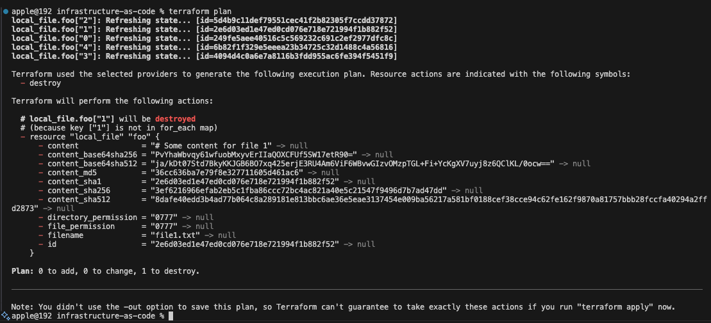

# Add steps/actions here:

The current setup uses `count`, so Terraform tracks the files by position:

So instead of using count, just use an array of variables and loop through the file using foreach.

## 1. Change the code to use foreach

Change the variable and resource like this:

```hcl

variable "files" {
  default = ["0", "1", "2", "3", "4"]
}

resource "local_file" "foo" {
  for_each = toset(var.files)

  content  = "# Some content for file ${each.key}"
  filename = "file${each.key}.txt"
}
```

## 2. Move the existing state

Now move the current state from the old count addresses to the new for_each addresses:

You will notice that I am now using quotes when I am referrencing the new address of files within the statefile instead of int.

```bash
terraform state mv 'local_file.foo[0]' 'local_file.foo["0"]'
terraform state mv 'local_file.foo[1]' 'local_file.foo["1"]'
terraform state mv 'local_file.foo[2]' 'local_file.foo["2"]'
terraform state mv 'local_file.foo[3]' 'local_file.foo["3"]'
terraform state mv 'local_file.foo[4]' 'local_file.foo["4"]'
```

This keeps the existing files as they are and just tells Terraform to track them differently. You will see backups whenever you create the move.

## 3. Remove the 2nd resource

The 2nd resource is file1.txt, so remove key "1" from the list:

```hcl
variable "files" {
  default = ["0", "2", "3", "4"]
}
```

Now Terraform should only want to remove:

```text
local_file.foo["1"]
```

## 4. Check the plan

Run:

```bash
terraform plan
terraform apply "This command is optional, you can use it if you want you state to be updated"
```

At this point the plan should show only one destroy, for local_file.foo["1"].

Example:

