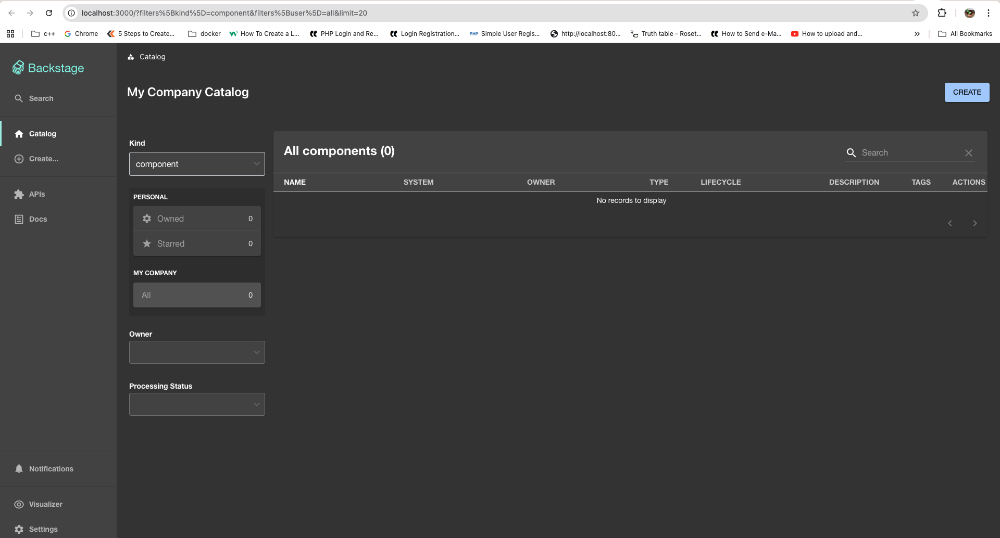

Run Backstage from the "wild/backstage-app" folder.

Use Node 22 or Node 24.

```bash
cd wild/backstage-app
node .yarn/releases/yarn-4.4.1.cjs install
node .yarn/releases/yarn-4.4.1.cjs start
```

Once it starts, open:

```text
http://localhost:3000
```

Example:


